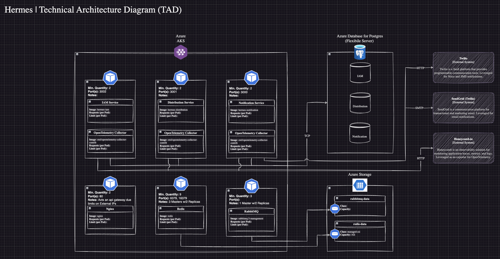
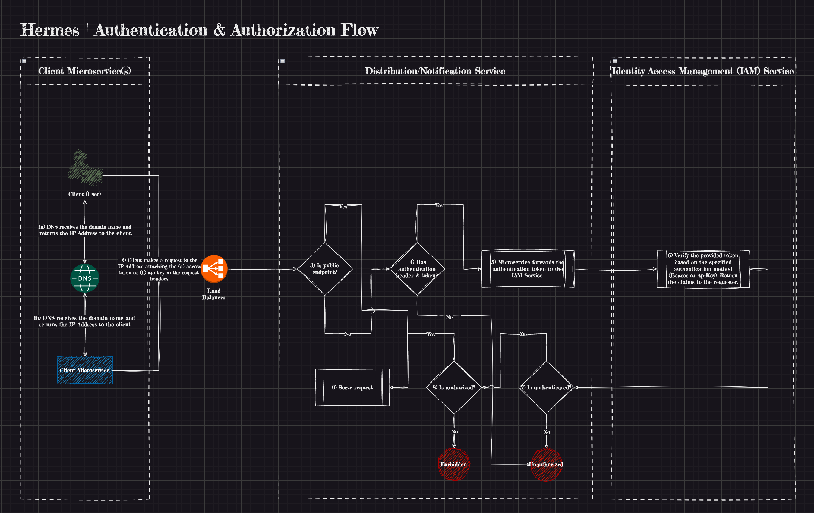

<div align="center">

# Hermes

##### Another application that claims to be... blazingly fast 🔥🔥


<br/>
<br/>


</div>

## The Problem

Imagine you are an entry-level software engineer supporting the development of a new web client for an alarm system in your second year. It's only you and the lead developer. The lead developer decides to pursue another opportunity, and suddenly you find yourself promoted to the lead despite your inexperience. As you're exploring the solution, you start getting incident ticket after incident ticket reporting that alarm notifications aren't working, so you begin to investigate. Your realize that, with your focus on the frontend, you never noticed that the application had about 20 microservices in the backend, all communicating through RESTful APIs. (it has more microservices than frontend screens - deep breath 😰) You then begin to investigate how the microservices communicate, only to find nested calls within nested calls. Your nightmare truly begins.

## The Solution

Fast-foward 1.5 years, with a wealth of knowledge earned under the constant barrage of incident tickets that plagued the notification service and increased expectations as the lead developer. You set out to broaden and test your understanding of software architectures and explore concepts like message brokers and caching, which you haven't yet applied professionally. One project comes to mind - a notification service. Motivated by the knowledge your team plans to rewrite the notification service in the future, and the hope your project will eventually be forked and replace the notification service leveraged at work, you begin your work. This is that project.

### Requirements

1. Deliver notifications through a variety of methods (email, phone, text message, and web push notifications) and should support the addition of new types of notifications.
2. Ability to deliver multiple notifications based on subscriptions to a distribution event.
3. Application should be reliable (alarm notification's are critical 🚨) and try to deliver notification's at least once.
4. Clearly defined responsibilities and communication between services without becoming overly granular.
5. Distributed telemetry is collected for improved insights into failure points.
6. The solution should be flexible and support a variety of uses causes (ambitious, I know 😬)

### Architecture

<div align="center">
    
</div>

<br/>
<br/>

Hermes implements a microservices architecture to achieve it's requirements for reliablility and scalability. While this introduces similar challenges to the original notification implementation, such as communication and tracebiility, it focuses the business domain into three services: _Identity Access Management (IAM), Distribution,_ and _Notification_.

#### Identity Access Management (IAM)

Manages the creation of users and api keys, assignment of permissons, and validates generated access tokens and api keys before Hermes resources may be accessed.

<div align="center">

###### Entity Relationship Diagram


</div>

#### Distribution

A rules engine that accepts a distribution event, evaluates the associated data to see if there are any registered subscriptions interested in that event, and generates notification jobs.

<div align="center">

###### Entity Relationship Diagram


</div>

#### Notification

Responsible for compiling the notification template with the data and sending the notification.

<div align="center">

###### Entity Relationship Diagram


</div>

### Authentication & Authorization

<div align="center">
    
</div>

<br/>

The Identity Access Management (IAM) service in Hermes provides two mechanisms for securing REST/Graphql endpoints: _acess tokens (JSON Web Tokens or JWTs)_ and _API keys_. The primary distinctions between the two methods are as follows:

- **Access Tokens**: These tokens authenticate user's identity when accessing an endpoint. Access tokens are short-lived and paired with a _refresh token_ that can used to obtain new tokens before the initial token expires. Access tokens may be invalidated in the following if:

  1. Modification (update or delete) of the user's profile.
  2. A refresh token is redeemed. One-time use for refresh tokens for a new token pair is enforced to prevent replay attacks. This achieved through a _Refresh Token Rotation_, ensuring a user possesses only a single valid token pair at any time.

- **API Keys**: These keys identify the calling project (or application) accessing an endpoint. API Keys are long-lived and should be securely stored. An API key is generated by encoding a claims object in base64 format, which is then hased for storage (similar to password hashing). The base64 encoded key is returned to the user who generated the API key for subsequent authentication and authorization.

  _Designer's Note: Since API keys are stored as a hash, they cannot be modified after they are created._

The claims structure for both access tokens and API keys adheres to a similar format.

```javascript
    {
      sub: "",                          // Subject identifier (ID) associated with subject (user)
      name: "",                         // Name of the subject
      authorization_details: [""];      // An array of strings representing te permissions. Each permission contains data to specify the allowed actions (example: VideoGame=Walk,Run)
    }
```

_See the respective token classes for additional fields related to their specific use case._

Once an entity has been authenticated with a valid token, each service evaluates the `authorization_details` within the claims object to determine whether the subject has permission to perform the requested action on a resource. Below is a list of potential permissions associated with the service and resource.

<div align="center">

###### Permissions

|   Service    |       Resource       |                         Actions                         |
| :----------: | :------------------: | :-----------------------------------------------------: |
| Distribution |  distribution_event  |                  create,update,remove                   |
| Distribution |  distribution_rule   |                  create,update,remove                   |
| Distribution |     subscription     |                  create,update,remove                   |
| Distribution | distribution_message |                         publish                         |
|     IAM      |         user         |              list,get,create,update,remove              |
|     IAM      |      permission      |              list,get,create,update,remove              |
|     IAM      |       api_key        |                      create,remove                      |
| Notification |    email_template    |                  create,update,remove                   |
| Notification |    phone_template    |                  create,update,remove                   |
| Notification |    push_template     |                  create,update,remove                   |
| Notification |     notification     |         send_email,send_sms,send_call,send_push         |
| Notification |   notification_job   | schedule_email,schedule_sms,schedule_call,schedule_push |

</div>

_Designer's Note: The permissions can be seeded into the database with the **create_permissions.sql** in the scripts directory. You may need to adjust the generation of the random universal unique identifier (UUID)._

### How is a notification sent?

<div align="center">
    
</div>

1.  The first step in the journey to create a notification, is the _client microservice_. This service defines one or more conditions for triggering a notification. Once the service identifies these conditions, it publishes a message to [RabbitMQ](https://www.rabbitmq.com/). For the distribution service to process this message successfully, it must adhere to the following format:

    ```javascript
        {
            "id": "",           // Universal Unique Identifier (UUID4) identifying the individual message
            "type": "",         // name of the distribution event that should be triggered
            "payload": {},
            "metadata": {},
            "timeZone": "",
            "recipients": [],
            "addedAt": ""
        }
    ```

2.  RabbitMQ, a reliable and feature-rich message and streaming broker, was selected for this project due to it's powerful routing capabilities that allow for additional exchanges and queues to be added without impacting the producing or consuming services. As an added bonus, it is easy to set-up and deploy on cloud environments or run locally. Upon receiving the messsage from the client microservice, RabbitMQ routes it to the appropriate queue for the distribution service.

3.  The _distribution service_ acts as a rules engine that identifies if there are any registered listeners interested in the message. Once the message enters the service, it first undergoes rehydrate and validation. If the message passes validation, processing continues; otherwise it will be marked as corrupted. Corrupted messages are logged to the `DistributionLog` table of the database, and the message will **not** be retried. (all processed messages are stored entered into the database!)

4.  After validating the message, the distribution proceeds to identify and retreive the relevant distribution event. A _distribution event_ is predefined trigger with a set of _distribution rules_ that dictate how and when notifications should be sent to recipients. It is responsible for ensuring the right information is delivered to the correct recipients in the appropriate manner.

5.  The next step in the process is selecting the appropriate _distribution rules_ from those defined for an event. This selection determines the methods and conditions for dispatching a notificcation. Consider the following distribution event and associated rules:

    <div align="center">
        
    </div>

    <br/>

    The `order-confirmation` distribution event specifies certain message labels for evaluation, in this example the `languageCode` label. Two rules are defined for this event:

    - **Distribution Rule #1**: Does not contain any metadata - this is known as the **default distribution rule**. Each distribution event is required to have a default rule to ensure notification delivery when no specific rules match.
    - **Distribution Rule #2**: Contains metadata specifying `"languageCode": "es-MX"`.

    <br/>

    ```javascript
        {
            "id": "34e37416-87ed-496c-b55e-6189b7a383ef",
            "type": "order-confirmation",
            "payload": {},
            "metadata": {
                "languageCode": "es-MX",
            },
            "timeZone": "America/Chicago",
            "recipients": [],
            "addedAt": "2025-01-23T00:30:45.914Z"
        }
    ```

    A distribution rule is selected for a message if all evaluated labels match those in the message metadata. In the example above, Distribution Rule #2 would be selected because the `languageCode` label evaluates to `es-MX`, which matches the rule's condition. If a match was not found, the default distribution rule would've been applied.

    _Designer's Note: The metadata labels are inspired by Kubernete's [Labels & Selectors](https://kubernetes.io/docs/concepts/overview/working-with-objects/labels/) that are used by a deployment to identify which pods it should control. By specifying the labels to be evaluated, an event's behavior is guaranteed even if additional labels are added by the client microservice for other consumer._

6.  Once a distribution rule is selected, the distrubtion service filters and retreives subscriptions for the distribution event. A _subscription_ expresses interest in a specific event type and can filter individual message payloads to determine if it should be notified. There are three types of subscriber:

    - **Request**: Registers a callback hook to request subscriber details from the _Identify Access Management (IAM) service_ using a subscriber ID.
    - **Device**: Registers a device for receiving web push notifications.
    - **User**: Directly stores a user's contact information and notification preferences in the distribution service's database. _This approach is primarily recommended for development and debugging purposes due to the concerns about separation of responsibilities._

    A subscription's filters are composed by setting the `filterJoin` property to `AND`, `OR`, or `NOT`, which determines the logical combination of filter results. Each filter compromises:

    - `field`: Object key in the message's payload against which the filter is applied. Nested keys are delimited by "." and array elements are delimited by "\*"
    - `operator`: Defines how the field's value is evaluated, such as `EQUALS`, `NEQUALS`, `OR`, or `MATCHES`
    - `dataType`: The data type of value being evaluated
    - `value`: The value to be compared

    After filtering subscriptions, the service requests data for any **request** subscribers that should receive a notification. All subscriber types are rehydrated and validated. If a subscriber is deemed invalid, it is discarded, and error message is logged to the console.

    _Designer's Note: A distribution rule can set the `bypassSubscriptions` flag to `true`. This indicate the subscriptions for a distribution event should not be retreived and instead the message's `recipients` property contains a list of user's who should be notified instead._

7.  With the subscriber list prepared, the next step is to transform these subscribers into notification jobs that can be published to [BullMQ](https://docs.bullmq.io/). BullMQ provides a robust queuing system built on [Redis](https://redis.io/) streams making it an excellent choice for one-to-one communication between services, such as from the distribution service to the notification service.

    The conversion process can be broken down into 3 steps:

    1. **Match Delivery Methods**: The initial task is to check whether any of the delivery methods specified in the distribution rule align with the subscriber's preferred notification methods - `EMAIL`, `SMS`, `CALL`, `PUSH_NOTIFICATION`. If there is a matching delivery method, the subcriber's ntofication windows are checked to ensure that the current date and time fall within any of these specified windows. This is achieved by calculating the start time in the subscriber's time zone and adding the duration to determine the end time.
    2. **Recipient Generation**: Subscribers who meet the delivery criteria are then converted into recipients for each applicable notification method. Recipients are grouped by delivery method and filtered for uniqueness, ensuring that each subscriber receives only one notification per event.
    3. **Job Creation**: A notification job is created for each recipient, including the corresponding template, message data, and recipient contact information. These jobs are then added to the queue, where the notification service can begin processing them.

    _Designer's Note: A distribution rule can set the `checkDeliveryWindows` flag to `false`. This indicate the subscribers' delivery windows should be ignored and all subscribers should receive a notification for enabled delivery methods._

8.  We've reached the final step in the notification process! 😁 Once one or more notification jobs have been added to BullMQ, the _notification service_ steps in to handle the rest. This service's is tasked with compiling templates and dispatching notifications.

    It begins by identifying the type of job it is processing. It rehydrates and validate the job to minimize the risk of failure (sound familiar? each service ensures the validatity of data regardless of source to ensure reliability 💪). If the job passes validation, the service proceeds to compile the [Handlebars](https://handlebarsjs.com/) template using the job's data and sends out the notification. Similar to the distribution service, the notification service maintains a log of all processed notification jobs in the `NotificationLog` database table.

### Performance Estimation

Coming Soon 🔜

### Observability - OpenTelemetry

Coming Soon 🔜

## Getting Started

### Installation

In the root directory, you need to install the dependencies.

```bash
$ npm install
```

### Running the Application(s) for Development

Before running one of the applications locally, you need to add a _application-name_.env file to the env directory (there are samples provided). Each file contains the configuration required to connect to infrastructure components (Postgres, RabbitMQ, Redis, etc.) as well as control over some of the application's behavior (retries, authentication, etc.).

```bash
# w/node
$ npm run start:[application-name]

# w/docker - recommended
$ docker compose up --build
```

### Build the Application(s)

To build the application(s) locally:

```bash
$ npm run build:[application-name]
```

To build the application(s) with Docker:

```bash
$ docker build -f docker/Dockerfile.prod ---build-arg APPLICATION=[application-name] --build-arg DEFAULT_PORT=[port-number] .
```

### Test Automation

```bash
# unit tests
$ npm run test

# end-to-end tests
$ npm run test:e2e
```

_Note: The end-to-end test automation **requires** [Docker](https://www.docker.com/get-started/) to be installed so that it can set-up a test database before execution._

#### Tips

1. When runing the unit tests, [watch mode](https://jestjs.io/docs/cli#--watch) enables Jest to monitor changes to file(s) and re-run tests related to changed files.

## References

- [NestJS](https://docs.nestjs.com/)
- [RabbitMQ Exchange Types](https://www.cloudamqp.com/blog/part4-rabbitmq-for-beginners-exchanges-routing-keys-bindings.html)
